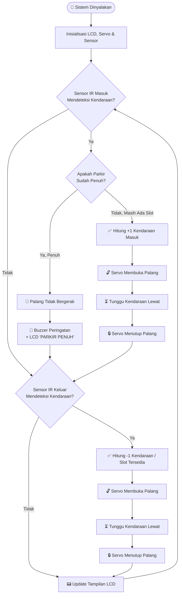
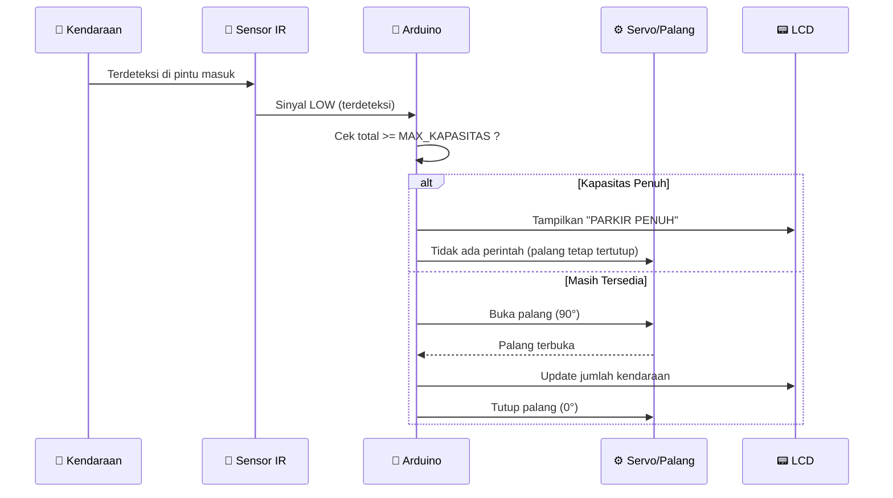

<div align="center">

# 🅿️ Smart Parking System — Arduino IoT

### Sistem Parkir Otomatis Berbasis Arduino dengan Sensor Inframerah, Servo, dan LCD


</div>

---

## 📖 Deskripsi

**Smart Parking System** adalah sistem otomatisasi palang parkir berbasis **Arduino Uno** yang mendeteksi kendaraan masuk dan keluar menggunakan **sensor inframerah (IR)**, menggerakkan **motor servo** sebagai palang otomatis, serta menampilkan status jumlah kendaraan secara **real-time** pada **LCD I2C 16x2**.

Sistem ini dilengkapi dengan **fitur pembatasan kapasitas otomatis**: ketika area parkir sudah penuh, palang **tidak akan terbuka** untuk kendaraan baru sampai ada kendaraan lain yang keluar terlebih dahulu.

> 💡 Proyek ini merupakan hasil pengembangan dari studi kasus mata kuliah **Metode Numerik**, dengan penerapan konsep sistem kendali berbasis kondisi (logika Bisection & Newton-Raphson digunakan pada tahap simulasi/estimasi kapasitas maksimum area parkir/wisata).

---

## ✨ Fitur Utama

| Fitur | Keterangan |
|---|---|
| 🚗 **Deteksi Otomatis** | Sensor IR mendeteksi kendaraan masuk & keluar secara independen |
| 🔒 **Pembatasan Kapasitas** | Palang **tidak akan bergerak** jika kapasitas parkir sudah penuh |
| 📟 **Tampilan Real-Time** | LCD I2C menampilkan jumlah kendaraan masuk, keluar, dan total slot terisi |
| 🔊 **Notifikasi Buzzer** | Bunyi buzzer sebagai isyarat saat palang terbuka & saat parkir penuh |
| ⚙️ **Servo Otomatis** | Palang membuka dan menutup otomatis tanpa intervensi manual |
| 🔁 **Auto Reset Slot** | Slot parkir otomatis tersedia kembali saat kendaraan keluar |

---

## 🧠 Alur Sistem (System Flow)



### Logika Pembatasan Kapasitas



---

## 🔧 Kebutuhan Perangkat Keras (Hardware)

| Komponen | Jumlah | Fungsi |
|---|---|---|
| Arduino Uno | 1 | Mikrokontroler utama |
| Sensor Infrared (IR) | 2 | Deteksi kendaraan masuk & keluar |
| Motor Servo (SG90/MG90) | 1 | Penggerak palang parkir |
| LCD 16x2 I2C | 1 | Tampilan status parkir |
| Buzzer | 1 | Indikator suara |
| Kabel Jumper & Breadboard | Secukupnya | Koneksi antar komponen |
| Adaptor 5V/9V | 1 | Sumber daya |

### 🔌 Skema Pin

| Komponen | Pin Arduino |
|---|---|
| Sensor IR Masuk | D13 |
| Sensor IR Keluar | D12 |
| Servo (Signal) | D9 |
| Buzzer | D10 |
| LCD I2C (SDA/SCL) | A4 / A5 |

---

## 📦 Instalasi & Penggunaan

### 1️⃣ Persiapan Software
Pastikan **Arduino IDE** sudah terinstal, lalu install library berikut melalui *Library Manager*:

```
LiquidCrystal_I2C
Servo (bawaan Arduino IDE)
Wire (bawaan Arduino IDE)
```

### 2️⃣ Clone Repository

```bash
git clone https://github.com/username/smart-parking-system.git
cd smart-parking-system
```

### 3️⃣ Upload ke Arduino
1. Buka file `sistem_parkir.ino` di Arduino IDE
2. Sambungkan Arduino Uno ke komputer via kabel USB
3. Pilih **Board**: Arduino Uno, dan **Port** yang sesuai
4. Klik **Upload**

### 4️⃣ Atur Kapasitas Maksimal
Sesuaikan jumlah slot parkir pada baris berikut sesuai kebutuhan lahan:

```cpp
const int MAX_KAPASITAS = 10;   // ubah sesuai kapasitas lahan parkir
```

---

## 🗂️ Struktur Proyek

```
smart-parking-system/
├── sistem_parkir.ino     # Kode utama Arduino
├── README.md              # Dokumentasi proyek
└── docs/
    └── wiring-diagram.png # (opsional) gambar rangkaian
```

---

## 🚀 Rencana Pengembangan (Roadmap)

- [x] Deteksi kendaraan masuk & keluar
- [x] Pembatasan kapasitas otomatis (palang tidak bergerak saat penuh)
- [ ] Integrasi dengan aplikasi mobile/web (monitoring jarak jauh via IoT/ESP8266)
- [ ] Penyimpanan data ke database (histori kendaraan)
- [ ] Sistem tiket otomatis dengan RFID/QR Code
- [x] Estimasi kapasitas dinamis menggunakan metode numerik (Bisection & Newton-Raphson)

---

## 🤝 Kontribusi

Kontribusi sangat terbuka! Silakan lakukan *fork*, buat *branch* baru, dan ajukan *pull request*.

```bash
git checkout -b fitur-baru
git commit -m "Menambahkan fitur X"
git push origin fitur-baru
```

---

## 📄 Lisensi

Proyek ini dilisensikan di bawah **MIT License** — bebas digunakan, dimodifikasi, dan didistribusikan untuk keperluan pembelajaran maupun pengembangan lebih lanjut.

---

<div align="center">

**Dikembangkan oleh Mardiansyah**
Program Studi Teknik Informatika — Universitas Teknologi Bandung

⭐ *Jika proyek ini bermanfaat, jangan lupa beri bintang pada repository ini!* ⭐

</div>
